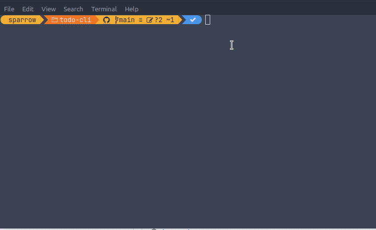

# todo-cli
A todo cli app build with go, add tests and flags to save and read from file.

### Demo

### Download
An executable is provided [here](https://github.com/sparrowsl/todo-cli/releases) for Windows, Mac and Linux
